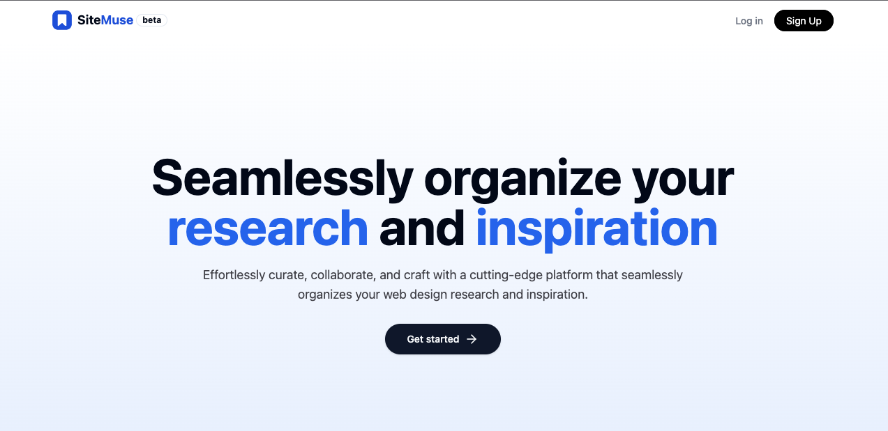

<a href="https://sitemuse.co">
  
  <h1 align="center">SiteMuse</h1>
</a>

<p align="center">
  An open-source tool for developers and designers to manage bookmarks and streamline research and inspiration.
</p>

<p align="center">
  <a href="https://twitter.com/hqasmei">
    
  </a> 
  <a href="https://github.com/hqasmei/site-muse/blob/main/LICENSE">
    
  </a>
</p>

<p align="center">
  <a href="#introduction"><strong>Introduction</strong></a> ·
  <a href="#local-development"><strong>Local Development</strong></a> ·
  <a href="#tech-stack"><strong>Tech Stack</strong></a> ·
  <a href="#contributing"><strong>Contributing</strong></a>
</p>
<br/>

## Introduction

SiteMuse is an open-source link management tool for modern marketing teams to create, share, and track short links. Built with [Next.js 13](https://nextjs.org/), [PlanetScale MySQL](https://planetscale.com/) and [Screenly](https://3.screeenly.com/).

## Local Development

To develop SiteMuse locally, you will need to clone this repository and set up all the env vars outlined in the [`.env.template` file](https://github.com/hqasmei/site-muse/blob/main/.env.template).

Once that's done, you can use the following commands to run the app locally:

```
npm install
npm run build
npm run dev
```

## Tech Stack

- [Next.js](https://nextjs.org/) – framework
- [Typescript](https://www.typescriptlang.org/) – language
- [Tailwind](https://tailwindcss.com/) – CSS
- [Vercel Analytics](https://vercel.com/) – analytics
- [PlanetScale](https://planetscale.com/) – database
- [UploadThing](https://uploadthing.com/) – database
- [Clerk](https://clerk.com/) – auth
- [Screenly](https://3.screeenly.com/) - screenshots
- [Vercel](https://vercel.com/) – hosting

## Contributing

We love our contributors! Here's how you can contribute:

- [Open an issue](https://github.com/hqasmei/site-muse/issues) if you believe you've encountered a bug.
- Make a [pull request](https://github.com/hqasmei/site-muse/pull) to add new features/make quality-of-life improvements/fix bugs.

<a href="https://github.com/hqasmei/site-muse/graphs/contributors">
  
</a>

## Repo Activity


## License

SiteMuse is open-source under the GNU Affero General Public License Version 3 (AGPLv3) or any later version.
